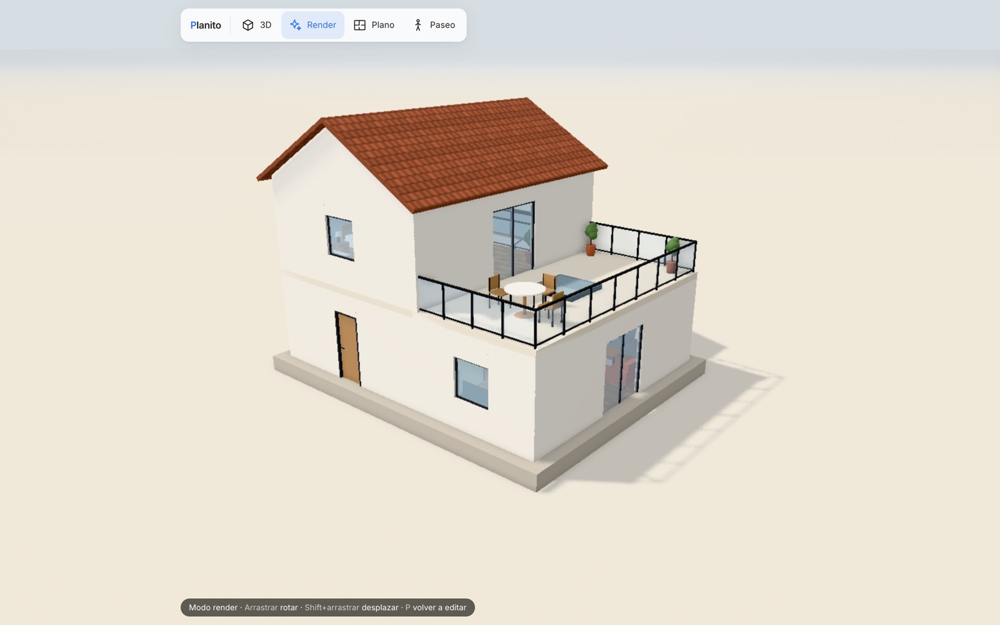
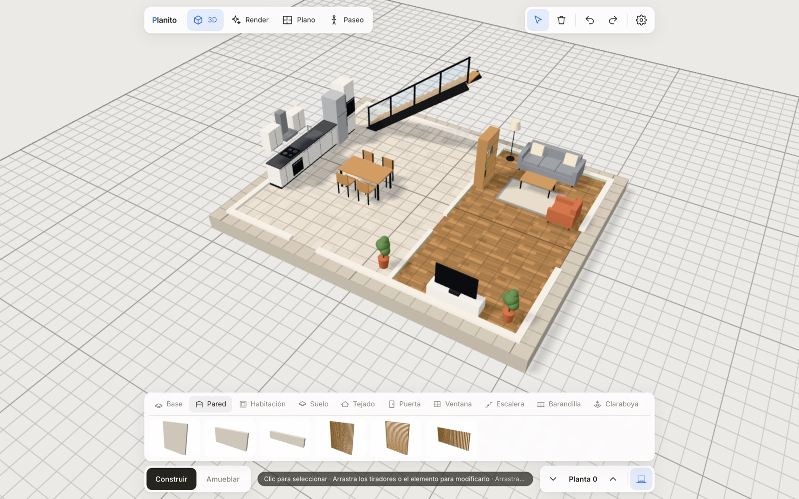
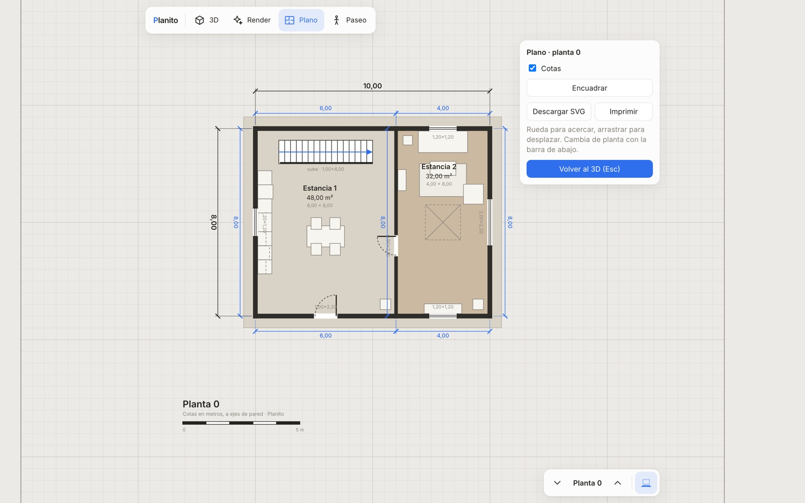
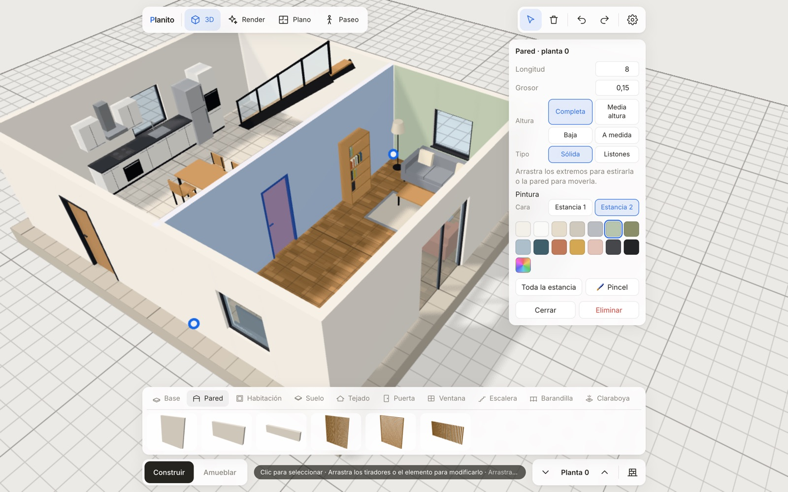
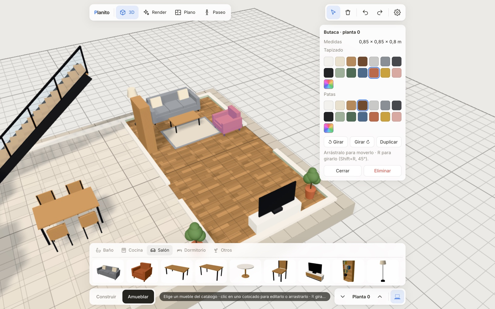
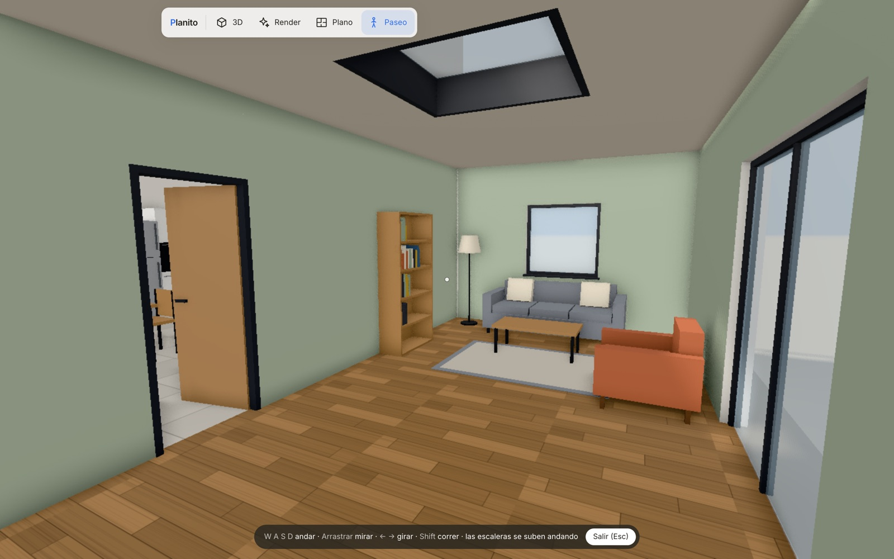

# Planito

**Planito** es un simulador web minimalista para dibujar casas en 3D, inspirado en el modo construir de Los Sims. Levantas una base, dibujas paredes, pones puertas, ventanas, escaleras y tejado, lo pintas, lo amueblas y te paseas por dentro. Todo en el navegador, sin instalar nada ni crear cuentas.



<table>
  <tr>
    <td width="50%"><br><sub><b>Construir</b>: paredes ocultas para ver la planta amueblada</sub></td>
    <td width="50%"><br><sub><b>Plano</b>: planta 2D con cotas y superficies, en SVG o para imprimir</sub></td>
  </tr>
  <tr>
    <td><br><sub><b>Pintar</b>: cada cara de pared, suelo, techo y tejado por separado</sub></td>
    <td><br><sub><b>Amueblar</b>: catálogo por estancias, con imán a las paredes</sub></td>
  </tr>
  <tr>
    <td colspan="2"><br><sub><b>Paseo</b>: recorre la casa en primera persona; las escaleras se suben andando</sub></td>
  </tr>
</table>

## Empezar

```bash
npm install
npm run dev
```

Abre la dirección que muestra Vite. La primera vez se carga una casa de ejemplo; con ⚙ → **Nuevo** empiezas un proyecto en blanco o con una base de las medidas que quieras. `npm run build` genera la versión estática en `dist/`.

## Qué se puede hacer

- **Estructura**: bases que se fusionan al solaparse y crecen solas cuando una pared se sale, paredes (completas, a media altura, bajas o a medida; sólidas o de listones), habitaciones de un trazo, suelos y techos por plantas, tejados a dos aguas o planos, escaleras (macizas o de zanca abierta, con barandilla inclinada), barandillas de cristal o barrotes y claraboyas.
- **Puertas y ventanas**: puerta simple, doble y de garaje; ventana normal, pequeña, alta, apaisada, balconera y ventanal. Se deslizan por su pared y la puerta elige tirador y sentido de apertura.
- **Pintura**: cada cara de cada pared por separado, estancias o fachada enteras de una vez, suelos (enteros o por zonas rectangulares) con madera, baldosa o microcemento, techos y tejados (teja, chapa o pizarra). Con el **pincel** pintas como en Los Sims.
- **Muebles**: baño, cocina, salón y comedor, dormitorio y otros. Los muebles de pared se pegan solos y se alinean con los vecinos, así que la cocina forma una encimera continua. Cada mueble tiene dos colores editables.
- **Vistas**: 3D para editar, Render con oclusión ambiental, Plano 2D con cotas, y Paseo en primera persona con colisiones.
- **Archivo**: guardado automático en el navegador, proyectos en `.json`, exportación del modelo a `.glb` (Blender, etc.) y capturas `.png`.

## Herramientas

| Tecla | Herramienta | Uso |
|---|---|---|
| V | Seleccionar | Clic para editar propiedades · Supr para borrar. Bases, suelos y tejados tienen tiradores en esquinas y lados; las paredes, en sus extremos (Shift = estirar en línea recta). Arrastrar una pared la desplaza en perpendicular: las que llegan en ángulo se estiran y los tramos en la misma línea se quedan quietos. Arrastrar cualquier otro elemento lo mueve (puertas y ventanas se deslizan por su pared). R gira la escalera seleccionada |
| B | Base | Arrastra un rectángulo. Si se solapa o toca con otra base, se suman en una sola. Altura en el panel ("Elevar base") |
| W | Pared | Clic, clic, clic… · Shift = recto · Esc / doble clic = terminar. En el panel: altura (completa, media altura 1,10 m, baja 0,50 m o a medida) y tipo (sólida o de listones verticales u horizontales, con color, ancho y separación). Se puede cambiar después en cualquier tramo |
| M | Habitación | Arrastra: crea 4 paredes |
| F | Suelo / techo | Arrastra. En la planta 1 o superiores hace de techo de la planta de abajo |
| T | Tejado | A dos aguas o plano (pendiente 0); alero y cumbrera editables |
| D / N / G / J | Puerta / Ventana / Ventanal / Garaje | Pasa por encima de una pared y haz clic |
| A | Barandilla | Clic a clic, como las paredes |
| S | Escalera | Sube a la planta siguiente y abre el hueco en el forjado · R = girar |
| K | Claraboya | Clic sobre un suelo o techo de la planta actual |
| C | Pincel | Clic pinta la cara de pared que tocas; Shift+clic, toda la estancia o fachada. En modo *zona de suelo*, arrastra un rectángulo. Esc termina |
| X | Borrar | Clic sobre cualquier elemento |

Las paredes se cortan solas en cada cruce o unión en T, y las que se superponen se fusionan: cada tramo es una pared independiente que se puede pintar por separado.

## Interfaz

La interfaz vive en una columna centrada de 920 px como máximo, para que no se estire en pantallas anchas.

- **Arriba a la izquierda**: las vistas **3D · Render · Plano · Paseo**.
- **Arriba a la derecha**: Seleccionar · Borrar · Deshacer · Rehacer · ⚙ (proyecto, rejilla, nuevo, abrir, guardar, ejemplo, exportar `.glb`, captura).
- **Abajo, el catálogo**, en dos niveles: pestañas de herramientas (en *Construir*) o estancias (en *Amueblar*), y debajo miniaturas 3D de las variantes o de los muebles.
- **Debajo del catálogo**: Construir / Amueblar, la ayuda de la herramienta, la planta (▼ ▲) y paredes visibles / ocultas.
- **Panel de la derecha**: lo seleccionado, con sus medidas, estilo y pintura.

## Navegación

- **Botón derecho**: rotar · **Shift + arrastrar** o botón central: desplazar · **Rueda / pellizco**: zoom
- En *Seleccionar* también se rota con el botón izquierdo. **Alt + arrastrar** rota con cualquier herramienta y **Espacio + arrastrar** desplaza.
- **Flechas ← → ↑ ↓**: desplazan la vista (↑ hacia donde mira la cámara). La velocidad se adapta al zoom y con **Shift** va más rápido. En el plano desplazan el dibujo.
- **Q / E**: girar la cámara 45°
- **+ / −** (o Re Pág / Av Pág): cambiar de planta · **H**: paredes visibles / ocultas (zócalo de 10 cm, como en Los Sims) · **P**: render · **L**: plano · **I**: paseo
- En el **paseo**: WASD o flechas para andar, arrastrar para mirar, Shift para correr, Esc para salir. No se atraviesan paredes (solo puertas) ni muebles.
- **Ctrl/Cmd + Z** deshacer · **Ctrl/Cmd + Shift + Z** rehacer

## Código

Vanilla JS con módulos ES, [Three.js](https://threejs.org) y [Vite](https://vite.dev). Sin frameworks ni backend: el modelo es un JSON y la geometría 3D se regenera a partir de él en cada cambio.

| Archivo | Qué hace |
|---|---|
| `src/main.js` | escena, cámara, render e interfaz |
| `src/state.js` | modelo de datos, deshacer/rehacer y autoguardado |
| `src/build.js` | genera la geometría 3D a partir del modelo |
| `src/tools.js` | herramientas de dibujo |
| `src/editor.js` | tiradores y arrastre para editar los elementos |
| `src/ops.js` / `src/poly.js` | operaciones de edición, cortes de paredes y fusión de bases |
| `src/rooms.js` | detección de estancias (recintos cerrados por paredes) |
| `src/paint.js` | pintura de paredes, suelos, techos y tejados (paletas y texturas procedurales) |
| `src/furniture.js` / `src/furnish.js` | catálogo de muebles, su geometría y la colocación con imán a las paredes |
| `src/catalog.js` / `src/thumbs.js` | barra de catálogo y miniaturas 3D renderizadas al vuelo |
| `src/panel.js` | panel de propiedades |
| `src/plan.js` | plano 2D con cotas (SVG) |
| `src/walk.js` | paseo en primera persona |
| `src/grid.js` | cuadrícula del solar (shader) |
| `src/example.js` | casa de ejemplo |

## Licencia

[GNU AGPL-3.0](LICENSE). Puedes usar, estudiar, modificar y redistribuir Planito. Si distribuyes una versión modificada, o la ofreces como servicio web, tienes que publicar también su código fuente con la misma licencia.
